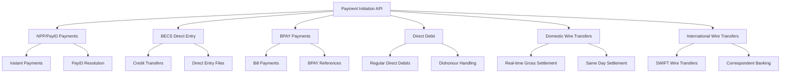
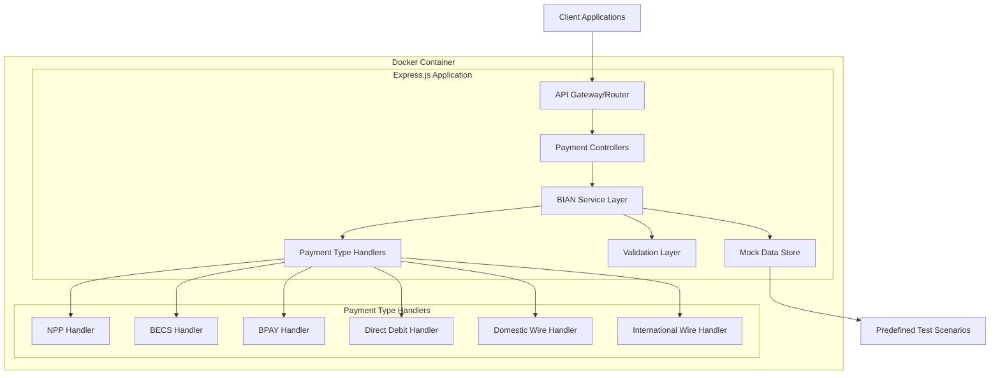

# Australian Bank Payment Initiation API - Architecture Plan

## Project Overview
Building a TypeScript-based payment initiation API following BIAN (Banking Industry Architecture Network) standards for Australian payment systems, containerized with Docker.

## BIAN Service Domain Implementation
The API will implement the **Payment Initiation** service domain with full BIAN standard operations:

### Core BIAN Operations
- **Initiate** - Create new payment instructions
- **Update** - Modify existing payment instructions
- **Request** - Submit payment for processing
- **Retrieve** - Get payment details and status
- **Control** - Cancel or hold payments
- **Exchange** - Handle status updates and notifications

## Australian Payment Types & Endpoints



## API Endpoint Structure

### 1. NPP (New Payments Platform) Endpoints
```
POST   /payment-initiation/npp-payments/initiate
PUT    /payment-initiation/npp-payments/{paymentId}/update
POST   /payment-initiation/npp-payments/{paymentId}/request
GET    /payment-initiation/npp-payments/{paymentId}/retrieve
PUT    /payment-initiation/npp-payments/{paymentId}/control
POST   /payment-initiation/npp-payments/{paymentId}/exchange
```

### 2. BECS (Bulk Electronic Clearing System) Endpoints
```
POST   /payment-initiation/becs-payments/initiate
PUT    /payment-initiation/becs-payments/{paymentId}/update
POST   /payment-initiation/becs-payments/{paymentId}/request
GET    /payment-initiation/becs-payments/{paymentId}/retrieve
PUT    /payment-initiation/becs-payments/{paymentId}/control
POST   /payment-initiation/becs-payments/{paymentId}/exchange
```

### 3. BPAY Endpoints
```
POST   /payment-initiation/bpay-payments/initiate
PUT    /payment-initiation/bpay-payments/{paymentId}/update
POST   /payment-initiation/bpay-payments/{paymentId}/request
GET    /payment-initiation/bpay-payments/{paymentId}/retrieve
PUT    /payment-initiation/bpay-payments/{paymentId}/control
POST   /payment-initiation/bpay-payments/{paymentId}/exchange
```

### 4. Direct Debit Endpoints
```
POST   /payment-initiation/direct-debit/initiate
PUT    /payment-initiation/direct-debit/{paymentId}/update
POST   /payment-initiation/direct-debit/{paymentId}/request
GET    /payment-initiation/direct-debit/{paymentId}/retrieve
PUT    /payment-initiation/direct-debit/{paymentId}/control
POST   /payment-initiation/direct-debit/{paymentId}/exchange
```

### 5. Domestic Wire Transfer Endpoints
```
POST   /payment-initiation/domestic-wires/initiate
PUT    /payment-initiation/domestic-wires/{paymentId}/update
POST   /payment-initiation/domestic-wires/{paymentId}/request
GET    /payment-initiation/domestic-wires/{paymentId}/retrieve
PUT    /payment-initiation/domestic-wires/{paymentId}/control
POST   /payment-initiation/domestic-wires/{paymentId}/exchange
```

### 6. International Wire Transfer Endpoints
```
POST   /payment-initiation/international-wires/initiate
PUT    /payment-initiation/international-wires/{paymentId}/update
POST   /payment-initiation/international-wires/{paymentId}/request
GET    /payment-initiation/international-wires/{paymentId}/retrieve
PUT    /payment-initiation/international-wires/{paymentId}/control
POST   /payment-initiation/international-wires/{paymentId}/exchange
```

## Technical Architecture



## Predefined Test Scenarios

### Success Scenarios
- **Amount < $100**: Instant success
- **Account ending in 0000**: Always successful
- **PayID ending in @success.com**: NPP success

### Failure Scenarios
- **Amount = $999.99**: Insufficient funds
- **Account ending in 1111**: Invalid account
- **Amount > $10,000**: Requires additional authorization
- **International transfers to "BLOCKED" countries**: Compliance failure

## BIAN Data Models

### Core Payment Instruction Structure
```typescript
interface PaymentInstruction {
  paymentInstructionReference: string;
  paymentInstructionType: PaymentType;
  paymentInstructionStatus: PaymentStatus;
  paymentInstructionAmount: MonetaryAmount;
  paymentInstructionDateTime: string;
  paymentMechanism: PaymentMechanism;
  debitAccount: AccountReference;
  creditAccount: AccountReference;
  paymentPurpose: string;
  remittanceInformation: string;
}
```

## Project Structure
```
tsapi/
├── src/
│   ├── controllers/
│   │   ├── npp-payment.controller.ts
│   │   ├── becs-payment.controller.ts
│   │   ├── bpay-payment.controller.ts
│   │   ├── direct-debit.controller.ts
│   │   ├── domestic-wire.controller.ts
│   │   └── international-wire.controller.ts
│   ├── services/
│   │   ├── bian/
│   │   │   ├── payment-initiation.service.ts
│   │   │   └── bian-operations.interface.ts
│   │   └── payment-handlers/
│   │       ├── npp.handler.ts
│   │       ├── becs.handler.ts
│   │       ├── bpay.handler.ts
│   │       ├── direct-debit.handler.ts
│   │       ├── domestic-wire.handler.ts
│   │       └── international-wire.handler.ts
│   ├── models/
│   │   ├── bian/
│   │   │   ├── payment-instruction.model.ts
│   │   │   ├── payment-status.model.ts
│   │   │   └── common-types.model.ts
│   │   └── australian-payments/
│   │       ├── npp.model.ts
│   │       ├── becs.model.ts
│   │       ├── bpay.model.ts
│   │       ├── direct-debit.model.ts
│   │       ├── domestic-wire.model.ts
│   │       └── international-wire.model.ts
│   ├── middleware/
│   │   ├── validation.middleware.ts
│   │   ├── error-handler.middleware.ts
│   │   └── request-logger.middleware.ts
│   ├── utils/
│   │   ├── test-scenarios.util.ts
│   │   ├── bian-helpers.util.ts
│   │   └── australian-validation.util.ts
│   ├── routes/
│   │   └── payment-initiation.routes.ts
│   ├── config/
│   │   ├── app.config.ts
│   │   └── payment-types.config.ts
│   └── app.ts
├── tests/
├── docker/
│   └── Dockerfile
├── docs/
│   ├── api-specification.yaml
│   └── bian-compliance.md
├── package.json
├── tsconfig.json
├── docker-compose.yml
└── README.md
```

## Implementation Phases

### Phase 1: Core Infrastructure
1. Set up TypeScript project with Express.js
2. Implement BIAN service domain structure
3. Create base payment instruction models
4. Set up Docker configuration

### Phase 2: Payment Type Implementation
1. Implement NPP/PayID payment endpoints
2. Implement BECS Direct Entry endpoints
3. Implement BPAY payment endpoints
4. Implement Direct Debit endpoints

### Phase 3: Wire Transfer Implementation
1. Implement Domestic Wire Transfer endpoints
2. Implement International Wire Transfer endpoints
3. Add comprehensive validation for each payment type

### Phase 4: Testing & Documentation
1. Implement predefined test scenarios
2. Create comprehensive API documentation
3. Add error handling and logging
4. Final testing and validation

## Key Features

### BIAN Compliance
- Full implementation of Payment Initiation service domain
- Standard BIAN operation patterns
- BIAN-compliant data models and error responses
- Proper HTTP status codes and headers

### Australian Payment Standards
- NPP ISO 20022 message formats
- BECS file format specifications
- BPAY reference validation
- BSB number validation
- PayID format validation

### Docker Configuration
- Multi-stage build for optimization
- Health checks for container monitoring
- Environment-based configuration
- Port exposure for API access

## Technology Stack
- **Runtime**: Node.js with TypeScript
- **Framework**: Express.js
- **Validation**: Joi or Zod for request validation
- **Documentation**: OpenAPI/Swagger
- **Containerization**: Docker with multi-stage builds
- **Testing**: Jest for unit and integration tests
- **Logging**: Winston for structured logging

## API Standards
- RESTful API design principles
- BIAN naming conventions
- ISO 20022 message standards for payments
- Australian payment scheme specifications
- Comprehensive error handling with meaningful error codes